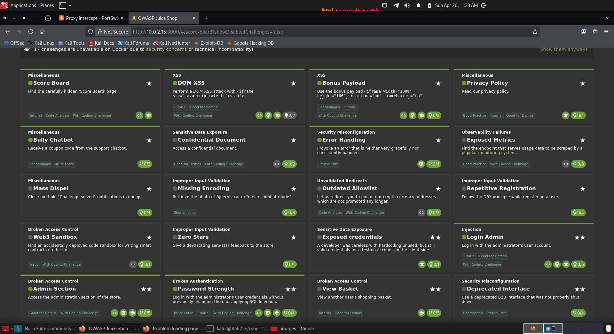

# OWASP Juice Shop — Security Assessment Report

## Overview

В рамках данного задания было развернуто уязвимое веб-приложение OWASP Juice Shop с использованием Docker, после чего проведён практический анализ его безопасности. Основная цель заключалась не только в нахождении уязвимостей, но и в понимании логики их эксплуатации и потенциальных последствий для реальных веб-приложений.

Приложение было запущено локально с помощью следующей команды:

sudo docker run -d --rm --name juice-shop -p 3000:3000 bkimminich/juice-shop

После запуска приложение стало доступно по адресу http://localhost:3000, что подтвердило успешное развертывание среды для тестирования.

---

## Vulnerability Analysis

В процессе анализа были выявлены и исследованы несколько типов уязвимостей, характерных для современных веб-приложений.

Первая выявленная уязвимость относится к типу DOM-based XSS. В данном случае пользовательский ввод обрабатывается на стороне клиента и напрямую вставляется в DOM без должной фильтрации. Это позволяет внедрить вредоносный JavaScript-код, который будет выполнен в браузере пользователя. Для демонстрации был использован следующий payload:

<iframe src="javascript:alert('xss')">

После ввода данного кода в соответствующее поле был успешно выполнен JavaScript, что подтверждает наличие XSS-уязвимости. Важно отметить, что в данном случае выполнение происходит не на сервере, а непосредственно в браузере, что делает атаку менее заметной со стороны серверной логики.

Следующая уязвимость связана с раскрытием информации (Information Disclosure). В ходе анализа было обнаружено, что внутренняя страница приложения доступна напрямую по URL:

http://localhost:3000/#/score-board

Доступ к данной странице осуществляется без какой-либо авторизации, что указывает на отсутствие контроля доступа. В результате пользователь получает доступ к списку всех уязвимостей приложения, что в реальной системе могло бы привести к значительным рискам безопасности.

Также была выявлена уязвимость, связанная с утечкой конфиденциальных данных (Sensitive Data Exposure). В процессе исследования интерфейса и доступных функций приложения было установлено, что некоторые ресурсы доступны без проверки прав доступа. Это означает, что злоумышленник может получить доступ к информации, которая должна быть ограничена.

Дополнительно было обнаружено, что приложение некорректно обрабатывает ошибки (Improper Error Handling). При вводе некорректных данных система может возвращать сообщения об ошибках, содержащие информацию о внутренней логике или структуре приложения. Такие данные могут быть использованы для дальнейших атак, включая более точные SQL-инъекции или обход защиты.

---

## Summary

Практическая работа с OWASP Juice Shop позволила получить реальное понимание того, как именно возникают и эксплуатируются уязвимости в веб-приложениях. В отличие от лабораторных заданий с подсказками, данное приложение требует самостоятельного анализа и поиска точек входа, что приближает процесс к реальным условиям.

Полученные знания могут быть применены при тестировании безопасности реальных систем, а также при разработке защищённых веб-приложений.

###Screenshot

